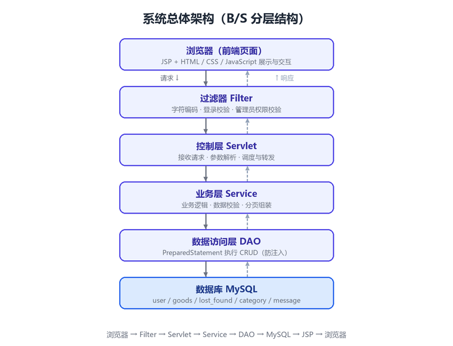
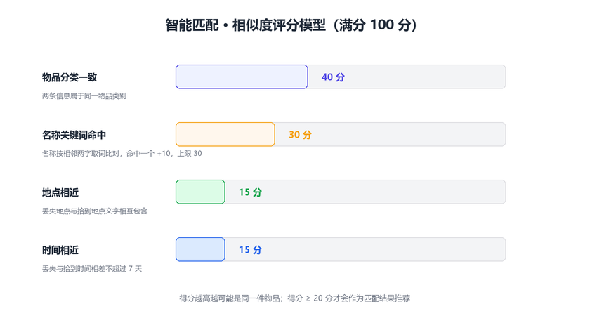
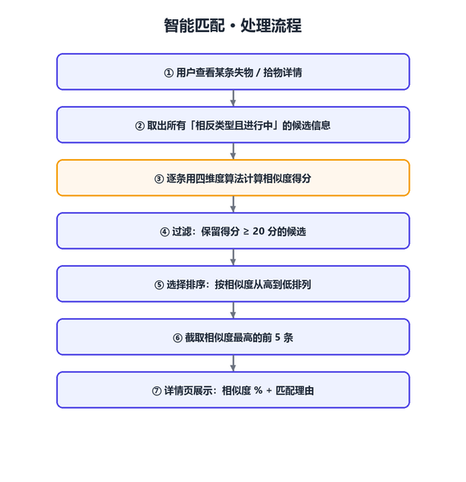
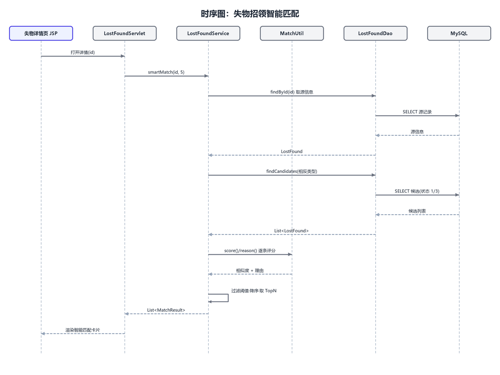
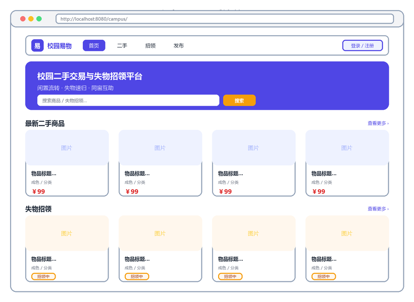
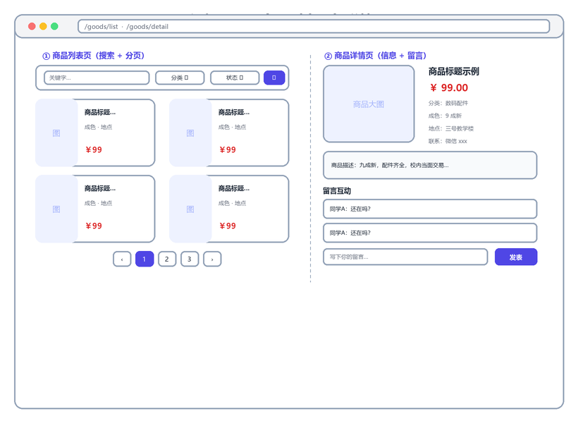
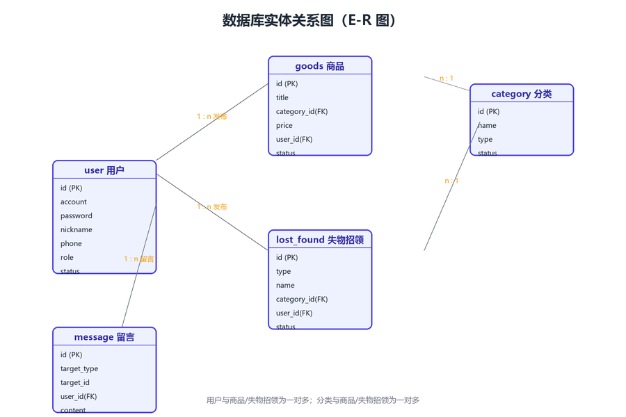
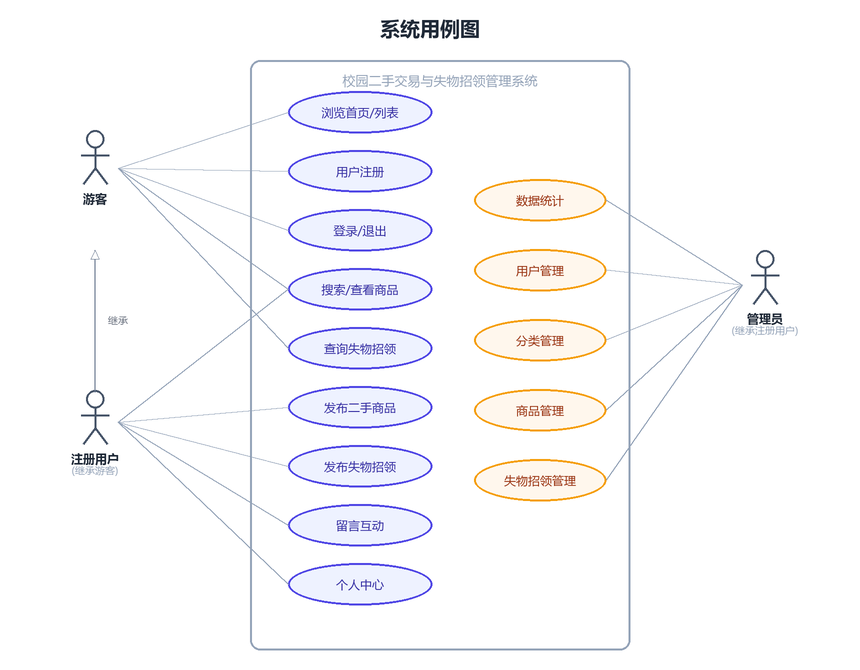

# 校园二手交易与失物招领管理系统

> 个人项目实训 · Java Web 课程设计

基于 **Java Web（Servlet + JSP）+ MySQL** 的 B/S 架构管理系统，采用经典的
「实体类 → DAO → Service → Servlet → JSP」分层结构开发，集中管理校园二手商品、
失物招领信息与用户留言。

核心亮点是 **失物招领智能匹配**：系统按「分类 / 名称 / 地点 / 时间」四个维度为失物与拾物
自动计算相似度并主动配对，把失物招领从「人翻列表」变成「系统推送」。

另一处工程亮点是 **全量 PreparedStatement 预编译防 SQL 注入**：所有数据访问统一走 `BaseDao`
封装的 `prepareStatement` + `setObject` 参数化绑定，用户输入永远作为「值」传入而不会拼进 SQL
语句，从根上杜绝注入；密码另经 MD5 加密存储。



---

## 一、特色功能：失物招领智能匹配

失物与拾物本质是同一件东西的两端。发布任一条失物/招领信息后，详情页会自动列出
最可能对应的反向信息，并给出相似度与匹配理由。

### 1. 四维度评分模型（满分 100）

| 维度 | 规则 | 分值 |
|------|------|------|
| 物品分类 | `categoryId` 完全相同 | +40（权重最高） |
| 名称特征 | 相邻双字关键词命中对方「名称 + 特征」 | 每命中 +10，上限 30 |
| 地点 | 两个地点字符串互相包含（「图书馆」⊂「图书馆一楼」） | +15 |
| 时间 | 丢失与拾到时间相差 ≤ 7 天 | +15 |

得分 ≥ **20** 才作为候选，按相似度降序取**前 5 条**展示。



### 2. 处理流程

1. **取候选** —— 只取「相反类型且进行中」的信息（失物找拾物，拾物找失物；状态限 `寻找中` / `待认领`）
2. **打分** —— 对每条候选用四维度算法计算 0~100 相似度
3. **过滤** —— 保留 ≥ 20 分，避免误推荐
4. **排序** —— 手写选择排序按分数降序
5. **截取** —— 返回相似度最高的前 5 条





### 3. 中文名称匹配

中文没有空格，直接分词需要引入第三方库。这里的做法是把名称的**相邻两个字**当作关键词
（「校园卡」→「校园」「园卡」），逐个到对方的「名称 + 特征」中查找，每命中一个 +10 分：

```java
for (int i = 0; i + 1 < name.length(); i++) {
    String word = name.substring(i, i + 2);   // 相邻两字成词
    if (text.contains(word)) hit++;
}
```

纯 `substring` + `contains` 实现，不依赖任何分词库。

核心代码：[`MatchUtil.java`](src/main/java/com/campus/util/MatchUtil.java)、
[`LostFoundServiceImpl.smartMatch()`](src/main/java/com/campus/service/impl/LostFoundServiceImpl.java)

---

## 二、技术栈

| 层次 | 技术 |
|------|------|
| 开发语言 | Java 8 |
| 后端 | Servlet 4.0、JSP、JSTL、Filter、Session |
| 持久层 | JDBC（PreparedStatement）+ MySQL 8 |
| 前端 | HTML5 + 自定义 CSS（Bootstrap 风格）+ 原生 JavaScript |
| 构建 | Maven（war 打包） |
| 服务器 | Apache Tomcat 9 |

项目未使用 Spring / SpringMVC / MyBatis 等框架，全部基于课程范围内技术手写实现。

---

## 三、功能特性

**前台（游客 / 注册用户）**

- 用户注册、登录、退出，Session 维持登录态
- 二手商品：发布、浏览、关键字 / 分类 / 状态多条件搜索、分页、详情、图片上传、修改、状态变更（在售 / 已售 / 下架）、删除
- 失物招领：失物 / 招领信息发布、按类型 / 关键字 / 分类 / 状态查询、状态流转（寻找中 / 已找回 / 待认领 / 已认领 / 已关闭）、**智能匹配**
- 商品与失物招领详情页留言互动
- 个人中心：修改资料、修改密码、查看「我的发布」

**后台（管理员）**

- 仪表盘数据统计（用户 / 商品 / 失物招领 / 分类数量 + 最新发布）
- 用户管理：查询、禁用 / 恢复、删除
- 分类管理：商品分类与失物招领分类的增删改、启停
- 商品管理：全站商品查询、状态维护、删除
- 失物招领管理：全站信息查询、状态维护、删除

**非功能特性**

- 三重 Filter：字符编码（UTF-8）→ 登录校验 → 管理员校验
- 密码 MD5 加密存储；全程 PreparedStatement 预编译防 SQL 注入
- 列表分页查询；统一异常与错误页

---

## 四、界面预览

| 首页 | 列表与详情（含智能匹配） | 后台管理 |
|------|--------------------------|----------|
|  |  |  |

---

## 五、数据库设计

5 张数据表：`user`（用户）、`category`（分类）、`goods`（二手商品）、
`lost_found`（失物 / 拾物信息）、`message`（留言）。

关系：用户 1—n 商品 / 失物招领；分类 1—n 商品 / 失物招领。





---

## 六、目录结构

```
campus-system/
├── pom.xml                      Maven 构建配置
├── sql/schema.sql               数据库建库建表 + 初始数据脚本
├── docs/images/                 README 与文档配图
└── src/main/
    ├── java/com/campus/
    │   ├── entity/              实体类（User/Category/Goods/LostFound/Message）
    │   ├── dao/                 DAO 接口 + BaseDao/RowMapper
    │   │   └── impl/            DAO 实现
    │   ├── service/             Service 接口
    │   │   └── impl/            Service 实现（含 smartMatch 智能匹配编排）
    │   ├── servlet/             控制器（含 admin 子包）
    │   ├── filter/              编码 / 登录 / 管理员过滤器
    │   └── util/                DBUtil / PasswordUtil / PageBean / UploadUtil /
    │                            MatchUtil（智能匹配算法）/ ServiceException
    ├── resources/
    │   ├── db.properties.example 数据库连接配置示例（复制为 db.properties 后填密码）
    │   └── ...
    └── webapp/
        ├── WEB-INF/web.xml      欢迎页、错误页、JSP 编码配置
        ├── WEB-INF/views/       JSP 视图（common/user/goods/lostfound/admin）
        └── static/              css / js / uploads（上传图片目录）
```

---

## 七、部署运行

### 1. 环境要求

JDK 1.8、Maven 3.6+、MySQL 8.x、Tomcat 9.x

### 2. 初始化数据库

```bash
mysql -u root -p < sql/schema.sql
```

脚本会创建数据库 `campus_system`、全部数据表并写入初始测试数据。

### 3. 配置数据库连接

把配置示例复制为实际配置，再填入本机 MySQL 密码：

```bash
cp src/main/resources/db.properties.example src/main/resources/db.properties
```

```properties
jdbc.username=root
jdbc.password=你的MySQL密码
```

> `db.properties` 含真实密码，已在 `.gitignore` 中排除，不会被提交。

### 4. 运行

**方式一（IDEA）**：导入为 Maven 项目，配置 Tomcat 9，部署 `campus-system:war exploded`，
启动后访问 `http://localhost:8080/campus-system/`。

**方式二（命令行 + Tomcat）**：

```bash
mvn clean package
# 将 target/campus-system.war 复制到 Tomcat 的 webapps/ 目录，启动 Tomcat
```

### 5. 默认账号（密码均为 `123456`）

| 账号 | 角色 |
|------|------|
| admin | 管理员 |
| zhangsan / lisi / wangwu | 普通用户 |

### 6. 主要访问路径

| 路径 | 说明 |
|------|------|
| `/index` | 首页 |
| `/goods/list` | 二手市场 |
| `/lostfound/list` | 失物招领 |
| `/user/login`、`/user/register` | 登录 / 注册 |
| `/admin/index` | 后台管理（需管理员） |

---

## 八、说明

- 系统采用「登录墙」策略：未登录访问任何页面都会自动跳转到登录页，登录成功后方可使用全部功能。
- 上传图片保存在应用部署目录的 `static/uploads/` 下；生产环境建议改为应用外部独立目录。
- 智能匹配的相似度是**四维度加权总分**（0~100），用于相对排序，不代表「同一物品的概率」。
- 所有页面字符编码为 UTF-8，请使用 Chrome / Edge 等现代浏览器访问。

### 中文乱码说明

项目所有源文件均为 **UTF-8** 编码，运行时页面、数据库、日志均无乱码。
若在 **IDEA 中打开源码看到中文乱码**，是 IDE 在中文 Windows 下默认用 GBK 解码所致，
并非代码问题。项目已内置 `.editorconfig` 与 `.idea/encodings.xml` 强制 UTF-8；如仍乱码，请：

1. `File → Settings → Editor → File Encodings`，将 Global Encoding、Project Encoding、Default 均设为 **UTF-8**；
2. 对仍显示乱码的文件，使用 `File → Reload in Encoding → UTF-8` 重新加载。
