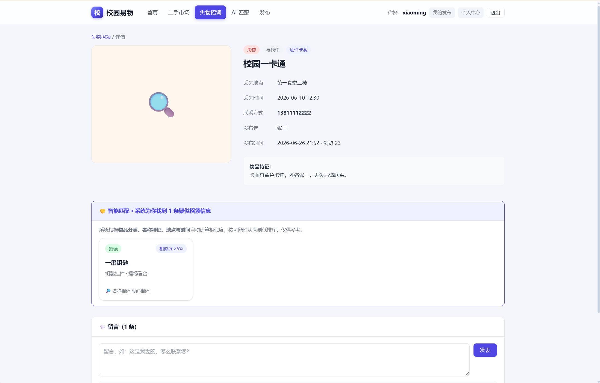
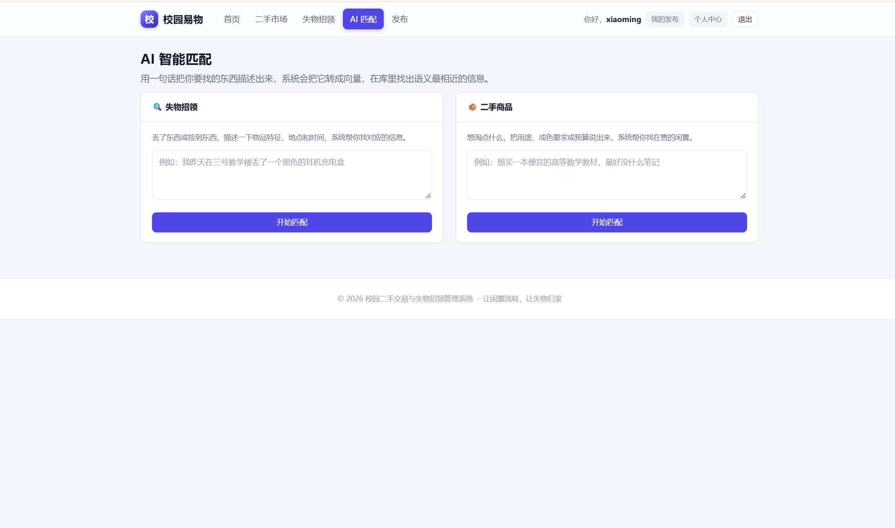
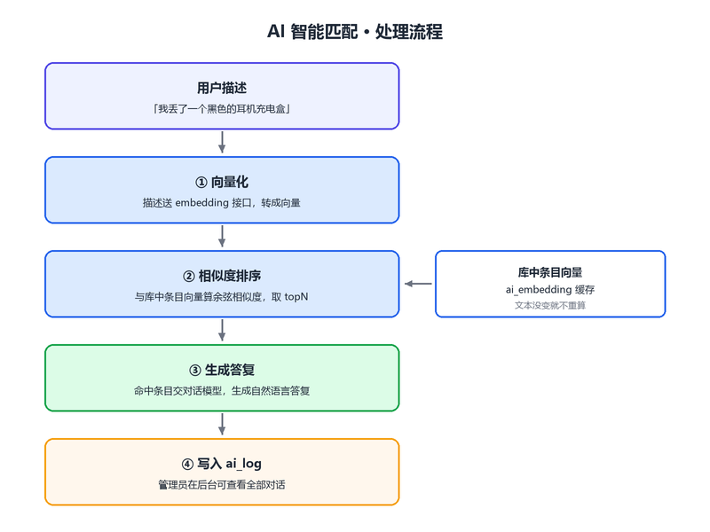
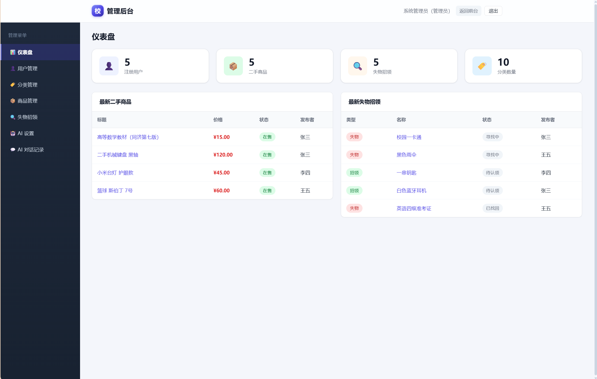
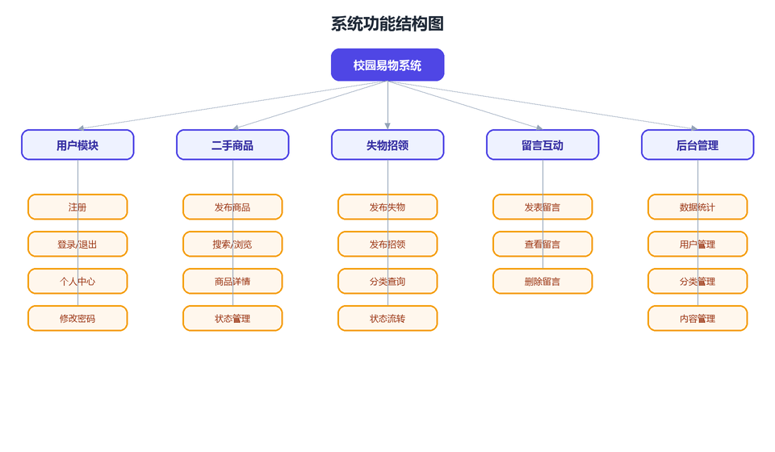

# 校园二手交易与失物招领管理系统

**Campus Secondhand Trading & Lost-and-Found Management System**


> 个人项目实训 · Java Web 课程设计

基于 **Servlet + JSP + MySQL** 的 B/S 架构校园信息平台，集中管理二手商品与失物招领。
除常规增删改查外，实现了两套**智能匹配**：详情页自动为失物与拾物配对的**规则匹配**，
以及用一句话描述即可跨库检索的 **AI 语义匹配**。


---

## 特色功能一：规则匹配（失物 ↔ 拾物）

失物与拾物本质是同一件东西的两端。打开任一条信息的详情页，
系统会自动列出最可能对应的**反向信息**，并给出相似度与匹配理由。
纯算法实现，**不依赖任何外部服务**。



从四个维度打分（满分 100）：

| 维度 | 规则 | 分值 |
|------|------|------|
| 物品分类 | `categoryId` 完全相同 | +40（权重最高） |
| 名称特征 | 相邻双字关键词命中对方「名称 + 特征」 | 每命中 +10，上限 30 |
| 地点 | 两个地点字符串互相包含（「图书馆」⊂「图书馆一楼」） | +15 |
| 时间 | 丢失与拾到时间相差 ≤ 7 天 | +15 |

得分 ≥ 20 才作为候选，降序取前 5 条。候选集只取「相反类型且进行中」的信息，
已找回、已认领的不再打扰用户。


其中**中文名称匹配**没有引入分词库——中文没有空格不好分词，所以把名称的
**相邻两个字**当作关键词（「校园卡」→「校园」「园卡」），逐个到对方的
「名称 + 特征」中查找：

```java
for (int i = 0; i + 1 < name.length(); i++) {
    String word = name.substring(i, i + 2);   // 相邻两字成词
    if (text.contains(word)) hit++;
}
```

核心代码：[`MatchUtil.java`](src/main/java/com/campus/util/MatchUtil.java)

---

## 特色功能二：AI 匹配（一句话跨库检索）

用户用自然语言描述要找的东西——比如「我昨天在三号教学楼丢了一个黑色耳机充电盒」，
系统按**语义**在失物招领和二手商品两个库里检索，并给出一段自然语言答复。



**工作流程**

1. 描述送 embedding 接口转成向量
2. 与库中条目的向量算**余弦相似度**，按相似度降序取 topN
3. 命中的条目交给对话模型，生成一段答复说明最可能是哪几条
4. 全过程写入 `ai_log`，管理员在后台可查



**为什么是两组配置**

DeepSeek 官方只提供对话模型、**没有 embedding 接口**，所以向量模型与对话模型
分成两组独立管理，每类可配多条、随时切换「使用中」。两者都按 OpenAI 兼容格式调用，
因此任何兼容该格式的服务商（硅基流动、通义、智谱、本地 Ollama……）都能接。

**后台管理**

- **AI 设置**：两组配置的增删改与切换启用、Key 只显示后 4 位、**在线测试连通性**；
  页面顶部直接显示当前是否真正可用、缺什么，保存时校验完整性，避免「保存成功却跑不起来」
- **AI 对话记录**：查看全部用户的提问、AI 回复、命中条数与耗时、失败原因

**几个实现要点**：向量按条目缓存，文本没变就不重算；未缓存的条目批量送接口
（一次请求算完，不逐条往返）；未配置对话模型时自动降级为纯向量检索；
接口报错原样带出并写入日志。

核心代码：[`AiServiceImpl`](src/main/java/com/campus/service/impl/AiServiceImpl.java)、
[`AiClient`](src/main/java/com/campus/util/AiClient.java)

---

## 功能一览

**前台** — 注册登录 · 二手商品发布 / 多条件搜索 / 状态流转 · 失物招领发布 / 查询 /
状态流转 · 详情页自动规则匹配 · AI 智能匹配 · 留言互动 · 个人中心

**后台** — 仪表盘统计 · 用户 / 分类 / 商品 / 失物招领管理 · AI 配置与对话记录





## 技术栈

Java 8 · Servlet 4.0 · JSP / JSTL · JDBC（PreparedStatement）· MySQL 8 · Tomcat 9 · Maven（war）

未使用 Spring / MyBatis 等框架，全部基于课程范围内技术手写实现；
唯一引入的第三方库是 **Gson**，用于解析 AI 接口返回的 JSON。


## 部署运行

```bash
# 1. 建库建表 + 写入测试数据
mysql -u root -p < sql/schema.sql

# 2. 配置数据库连接
cp src/main/resources/db.properties.example src/main/resources/db.properties
#    编辑 db.properties，填入本机 MySQL 密码

# 3. 打包并部署
mvn clean package
#    把 target/campus-system.war 放进 Tomcat 的 webapps/，启动 Tomcat
```

访问 `http://localhost:8080/campus-system/`。
默认账号：`admin`（管理员）、`zhangsan` / `lisi` / `wangwu`（普通用户），密码均为 `123456`。

**要启用 AI 匹配**：用 admin 登录 → 后台 → AI 设置，填入向量模型与对话模型的
接口地址、模型名和 API Key，点「测试连通性」确认可用后把 AI 功能切为开启。
仓库中不含任何密钥，页面顶部会提示当前是否可用、缺什么。

## 数据库

9 张表。业务表 `user` `category` `goods` `lost_found` `message`；
AI 表 `ai_config`（开关）`ai_provider`（服务商配置）`ai_log`（对话记录）`ai_embedding`（向量缓存）。


## 说明

- **登录墙**：未登录访问任何页面都会跳转到登录页；登录 / 注册页不展示功能导航
- **安全**：密码 MD5 存储，全部 SQL 走 PreparedStatement 预编译防注入
- **编码**：源码统一 UTF-8。若在 IDEA 里看到中文乱码，把 `File → Settings → Editor →
  File Encodings` 三项都设为 UTF-8 即可（是 IDE 默认用 GBK 解码所致，不是代码问题）
